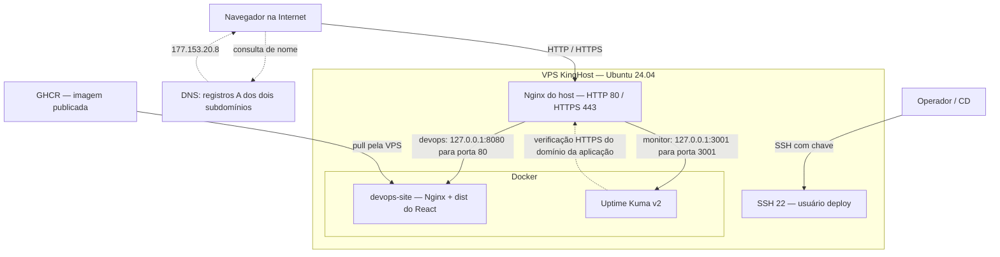

# 02 — Arquitetura do ambiente

## Visão geral

A VPS KingHost executa Ubuntu 24.04 LTS, com 2 vCPU, 4 GB de RAM, 70 GB de disco e IPv4 público `177.153.20.8`, conforme a evidência de provisionamento. O usuário não-root `deploy`, com sudo, acessa o servidor por SSH com chave.

DNS participa da resolução do nome, não do transporte da resposta HTTP. O navegador se conecta ao IP da VPS. O Nginx do host seleciona o serviço pelo domínio e termina TLS; o Nginx da aplicação entrega os arquivos estáticos.

## Portas e responsabilidades

| Endereço/porta | Uso | Exposição configurada |
| --- | --- | --- |
| 22/TCP | SSH administrativo e automação | Público, autenticado por chave |
| 80/TCP | HTTP no Nginx do host | Público |
| 443/TCP | HTTPS no Nginx do host | Público |
| `127.0.0.1:8080 → 80` | Aplicação em container | Loopback do host |
| `127.0.0.1:3001 → 3001` | Uptime Kuma | Loopback do host |

O UFW permite SSH, HTTP e HTTPS. O bind em `127.0.0.1` restringe as portas publicadas ao próprio host no modelo de rede usado; não se deve substituir essa configuração pela publicação em todas as interfaces. As regras do Docker também participam da rede: o status do UFW, isoladamente, não comprova a exposição de containers.

## Limites

Aplicação e monitor compartilham uma única VPS. O Kuma consegue observar a falha isolada da aplicação enquanto permanece ativo; uma queda completa da VPS também interrompe o monitor. O ambiente possui uma única instância da aplicação, e a recuperação demonstrada é manual.

O fluxo de publicação está em [CI/CD](10-processo-ci-cd.md); o caminho detalhado das requisições está em [HTTPS](09-configuracao-https.md).

## Evidências

[Índice](README.md) · [Tecnologias utilizadas](03-tecnologias-utilizadas.md)
