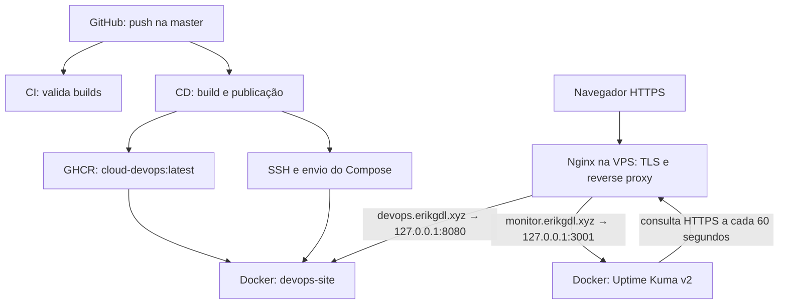
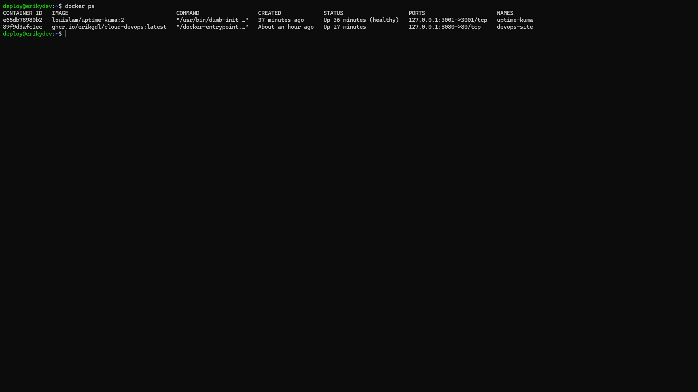

# 02 — Arquitetura do ambiente

## Visão geral
A VPS KingHost executa Ubuntu 24.04 LTS, com 2 vCPU, 4 GB de RAM, 70 GB de disco e IPv4 público `177.153.20.8`. O usuário `deploy` administra a aplicação por SSH com chave.

O CI e o CD são workflows independentes. A seta de publicação sai do CD; o arquivo atual não estabelece uma dependência de aprovação do CI.

## Portas e responsabilidades
| Porta/endereço | Responsabilidade |
| --- | --- |
| 22/TCP | Administração e automação por SSH |
| 80/TCP | Entrada HTTP no Nginx da VPS |
| 443/TCP | Entrada HTTPS no Nginx da VPS |
| 127.0.0.1:8080 → 80 do container | Conteúdo estático da aplicação |
| 127.0.0.1:3001 → 3001 do container | Interface do Uptime Kuma |

O Nginx da VPS recebe as conexões públicas e encaminha cada domínio ao serviço correspondente. O Nginx da imagem Docker serve os arquivos do React. São duas instâncias com funções distintas.

O bind em loopback impede acesso externo direto às portas publicadas dos containers. As regras UFW permitem OpenSSH, HTTP e HTTPS.

## Evidências

## Limite da arquitetura
Aplicação e monitoramento compartilham a VPS. O Kuma detecta falha do container da aplicação, mas uma queda completa da VPS também interrompe o próprio monitor.
