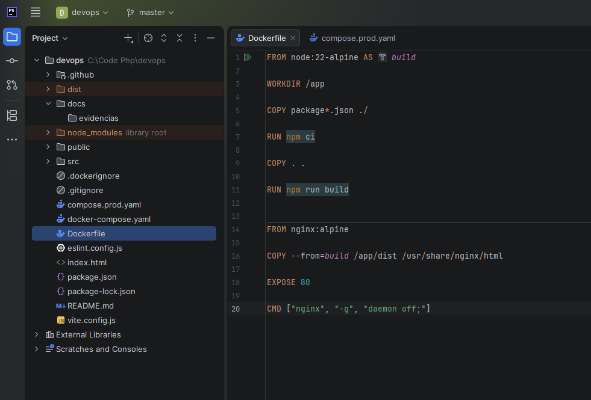

# 03 — Tecnologias utilizadas

| Tecnologia | Uso neste projeto |
| --- | --- |
| React 19 | Interface baseada em componentes |
| Vite 8 | Servidor de desenvolvimento e build estático |
| Node.js 22 e npm | Instalação das dependências e compilação |
| Git e GitHub | Versionamento e hospedagem do código |
| Docker | Imagem e execução isolada da aplicação |
| Docker Compose | Definição do serviço web em desenvolvimento e produção |
| Nginx na imagem | Entrega dos arquivos estáticos |
| Nginx na VPS | Reverse proxy dos dois domínios e terminação TLS |
| Ubuntu 24.04 LTS / KingHost | Sistema operacional e infraestrutura cloud |
| OpenSSH / ED25519 | Acesso remoto autenticado por chave |
| UFW | Regras de entrada para SSH, HTTP e HTTPS |
| GitHub Actions | Workflows CI e CD |
| GHCR | Armazenamento da imagem cloud-devops |
| GitHub Secrets | Valores usados na conexão SSH da automação |
| Certbot / Let's Encrypt | Gerenciamento e emissão de certificados TLS |
| Uptime Kuma v2 | Monitoramento HTTP(s), disponibilidade e histórico |

As versões principais de React e Vite vêm do `package.json`; o `package-lock.json` fixa as dependências usadas por `npm ci`. O Dockerfile usa `node:22-alpine` e `nginx:alpine`. A evidência dos containers mostra `louislam/uptime-kuma:2`.

## Como as ferramentas se complementam
O Vite transforma o código React em arquivos estáticos. O Docker empacota o resultado com Nginx. O CD publica a imagem no GHCR e atualiza sua execução na VPS. DNS e HTTPS fornecem acesso pelo domínio, enquanto o Kuma acompanha a resposta da aplicação.

O ESLint está configurado no projeto e possui o script `npm run lint`, mas esse script não é executado no workflow CI atual.

## Evidências

