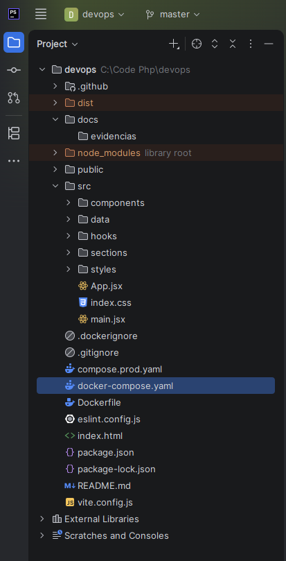

# 04 — Estrutura do projeto

## Organização

O projeto separa o código da interface, as configurações de execução, os workflows de automação e a documentação técnica.

```text
cloud-devops/
├── .github/workflows/
│   ├── ci.yml
│   └── cd.yml
├── docs/
│   ├── README.md
│   ├── 01-descricao-da-aplicacao.md
│   ├── ...
│   ├── 12-recuperacao.md
│   ├── 13-conclusao.md
│   └── evidencias/
├── public/
├── src/
│   ├── components/
│   ├── data/
│   ├── hooks/
│   ├── sections/
│   ├── styles/
│   ├── App.jsx
│   ├── index.css
│   └── main.jsx
├── .dockerignore
├── .gitignore
├── Dockerfile
├── docker-compose.yaml
├── compose.prod.yaml
├── eslint.config.js
├── index.html
├── package.json
├── package-lock.json
├── vite.config.js
└── README.md
```

## Responsabilidades

| Caminho | Função |
| --- | --- |
| `src/` | Código da interface, componentes, conteúdo, hooks e estilos |
| `public/` | Recursos estáticos da aplicação |
| `package.json` / `package-lock.json` | Scripts, dependências e resolução das versões |
| `Dockerfile` | Build multi-stage da distribuição |
| `docker-compose.yaml` | Construção e execução local |
| `compose.prod.yaml` | Execução da imagem do GHCR, com porta em localhost |
| `.github/workflows/` | Validação e publicação automatizadas |
| `docs/` | Referência técnica e evidências |

`node_modules/` é gerado pela instalação de dependências; `dist/` é gerado pelo build. O `.dockerignore` controla os arquivos enviados ao build Docker. Ao alterar o contexto de build, confira as exclusões para evitar o envio de arquivos de ambiente ou credenciais.

## Organização na VPS

O CD utiliza o diretório `~/devops-app` na conta `deploy` e envia `compose.prod.yaml` com o nome remoto `compose.yaml`:

```text
~/devops-app/
└── compose.yaml
```

Esse nome permite executar `docker compose` dentro do diretório sem `-f`. A imagem é obtida pelo GHCR; o fluxo não depende de clonar o código-fonte na VPS. Nginx do host, certificados e Kuma são administrados separadamente do Compose da aplicação.

## Evidência



[Índice](README.md) · [Instalação, VPS e segurança](05-processo-de-instalacao.md)
