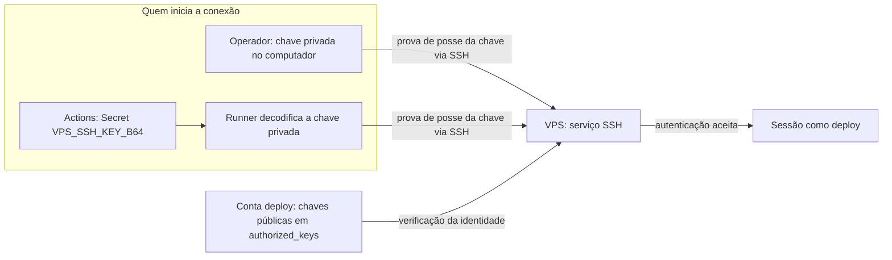
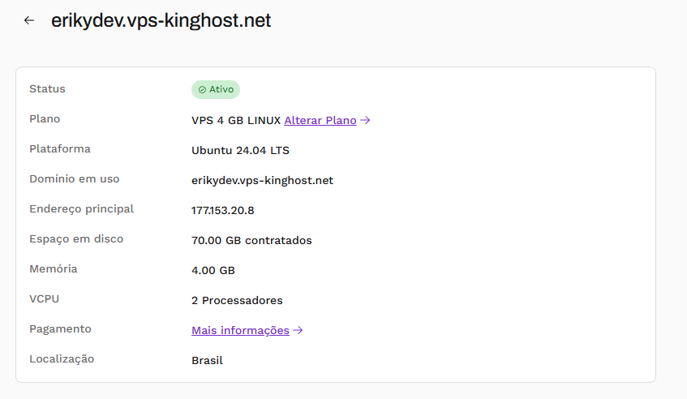
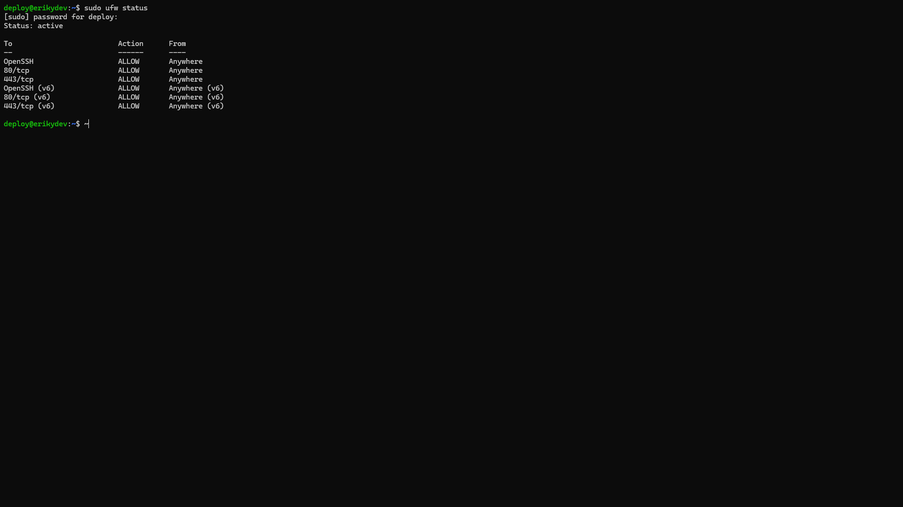

# 05 — Instalação, VPS e segurança

## Ambiente de desenvolvimento

O desenvolvimento utiliza Node.js 22 e npm. Na raiz do repositório:

```bash
npm ci
npm run dev
```

`npm ci` instala as dependências definidas no lockfile; `npm run dev` inicia o Vite e informa o endereço local. Para gerar os arquivos que serão publicados:

```bash
npm run build
```

O resultado fica em `dist/`. A alternativa de execução com Docker está em [configuração Docker](07-configuracao-docker.md).

## O que a VPS oferece ao projeto

Uma VPS é um servidor virtual com sistema operacional, rede e recursos próprios, hospedado na infraestrutura de um provedor. Neste projeto, ela mantém a aplicação funcionando sem depender do computador de desenvolvimento.

A VPS KingHost utiliza **Ubuntu 24.04 LTS**, 2 vCPU, 4 GB de RAM, 70 GB de disco e o IPv4 público `177.153.20.8`. Nela executam Docker, os containers da aplicação e do monitor, Nginx e Certbot.

A preparação compreendeu atualização do sistema, criação do usuário `deploy`, autorização de acesso SSH, configuração do UFW e instalação de Docker e Compose. O proxy, os certificados e o monitor são administrados separadamente do Compose da aplicação. O CD atualiza a aplicação nesse ambiente já preparado.

## Usuário deploy, root e sudo

`root` é a conta administrativa com controle amplo do sistema. O acesso cotidiano usa **`deploy`**, uma conta não-root com permissão para executar tarefas administrativas por `sudo`.

Por exemplo, consultar containers usa Docker; validar a configuração do proxy utiliza `sudo nginx -t`. Entrar como `deploy` separa a sessão cotidiana das ações administrativas, mas não elimina privilégios: sudo e acesso ao daemon Docker ainda permitem alterações importantes no host.

Essa separação aplica o **princípio de menor privilégio**: conceder o acesso necessário a cada finalidade e tratar autorizações administrativas como sensíveis.

## Senha, chave pública e chave privada: qual é a diferença?

O acesso SSH usa um **par de chaves**, não uma senha dividida em duas partes. As chaves são relacionadas matematicamente e têm funções diferentes:

| Elemento | Para que serve | Onde fica |
| --- | --- | --- |
| Senha da conta Linux | Autenticar a conta em situações que exigem senha, como certas operações com sudo | O operador conhece a senha; o sistema guarda uma representação protegida para verificá-la |
| Chave privada pessoal | Permitir que o cliente SSH prove a identidade do operador | No computador do operador, protegida de acesso indevido |
| Chave pública pessoal | Permitir que a VPS reconheça essa prova | Autorizada em `/home/deploy/.ssh/authorized_keys` |
| Passphrase da chave | Proteger o arquivo da chave privada, quando configurada | É informada ao cliente/agente SSH; não é a senha da VPS |
| Chave privada da automação | Autenticar o deploy feito pelo GitHub Actions | No Secret `VPS_SSH_KEY_B64`, em Base64; reconstruída no runner durante o job |
| Chave pública da automação | Autorizar a identidade usada pelo CD | Também em `/home/deploy/.ssh/authorized_keys` |

`authorized_keys` funciona como uma lista de chaves públicas autorizadas a acessar uma conta. Pode conter a chave do operador e a chave da automação, cada uma em sua linha. A chave pública não permite, sozinha, entrar no servidor.

Um par pode ter nomes como `id_ed25519` e `id_ed25519.pub`: nesse exemplo, o primeiro é o arquivo privado e o segundo é o público. Os nomes podem variar. É o conteúdo público que se adiciona a `authorized_keys`; o arquivo privado permanece no cliente que vai conectar.

## Como o SSH reconhece quem está entrando

Ao executar `ssh deploy@177.153.20.8`, o cliente solicita acesso à conta `deploy`. Ele usa a chave privada para produzir uma prova criptográfica; o servidor verifica essa prova com uma chave pública autorizada. **O arquivo da chave privada não é enviado para a VPS.** Depois da autenticação, a sessão permite executar comandos em um canal cifrado. Esse é o mecanismo de autenticação por chave do [OpenSSH](https://man.openbsd.org/sshd.8).



Os dois acessos usam pares separados. Assim, uma chave de automação pode ser substituída ou revogada sem exigir a troca da chave pessoal. Revogar o acesso de uma chave significa retirar a autorização correspondente, preservando as demais.

O caminho `~/.ssh/` depende da máquina e da conta em que o comando é executado: no computador pessoal é o diretório do operador; no runner é o diretório do job; na sessão da VPS é o diretório de `deploy`.

## Por que a automação não pede uma senha?

Um job de CD precisa conectar sem esperar alguém digitar. A chave de automação foi criada **sem passphrase** e seu acesso é protegido por GitHub Secrets e pelas permissões do arquivo no runner.

Passphrase é uma proteção adicional do arquivo privado: quando existe, precisa ser desbloqueada para o uso da chave. Ela é diferente da senha da conta Linux e não é enviada à VPS para autenticação. Veja a [explicação sobre passphrases](https://docs.github.com/en/authentication/connecting-to-github-with-ssh/working-with-ssh-key-passphrases).

A ausência de passphrase na automação não torna a chave pública. Quem obtiver a chave privada pode tentar usar a autorização correspondente; por isso ela não entra em commits, imagens Docker, prints ou logs.

## Base64 e a correção de libcrypto

Durante a configuração do CD, ocorreu um erro `libcrypto` no tratamento da chave. A solução adotada foi armazenar a chave privada codificada no Secret `VPS_SSH_KEY_B64` e reconstruí-la no runner antes da conexão.

Base64 transforma os bytes do arquivo em texto e facilita sua transmissão preservando o conteúdo. **Não cifra nem substitui a chave:** depois da decodificação, o resultado é o arquivo privado original. O valor em Base64 continua sendo secreto. O runner aplica permissão `600` ao arquivo, permitindo leitura e escrita apenas ao proprietário.

Essa correção trata o transporte e a reconstrução da chave; não significa que todo erro `libcrypto` tenha a mesma causa. Os nomes e as funções dos Secrets estão em [CI/CD](10-processo-ci-cd.md).

## Como o cliente reconhece o servidor

Há uma verificação no outro sentido: o cliente também precisa saber se está falando com a VPS correta. A chave pública de identidade do servidor pode ser registrada em `known_hosts`, no cliente.

Portanto, os arquivos têm papéis diferentes:

- **`authorized_keys`, na VPS:** quais chaves de clientes podem acessar a conta.
- **`known_hosts`, no cliente:** quais identidades de servidores ele conhece.

O CD utiliza `ssh-keyscan` para obter a chave apresentada pelo host. Essa coleta, sozinha, não confirma a identidade por um canal independente; comparar a impressão digital com uma fonte confiável é uma verificação adicional. As chaves de identidade do servidor não são o mesmo par utilizado pelo operador para entrar.

## Firewall e portas públicas

UFW administra as regras de firewall do host. O ambiente mantém permissões de entrada para SSH, HTTP e HTTPS:

| Porta | Uso |
| --- | --- |
| 22/TCP | Administração e automação por SSH |
| 80/TCP | Entrada HTTP no Nginx |
| 443/TCP | Entrada HTTPS no Nginx |

O firewall controla o tráfego; a autenticação SSH controla quem pode iniciar uma sessão. Uma porta SSH permitida não significa acesso sem autenticação.

As portas `8080` da aplicação e `3001` do monitor são publicadas em **`127.0.0.1`**, o endereço de loopback do próprio host. O proxy consegue acessá-las dentro da VPS. No computador de um visitante, `127.0.0.1` apontaria para o computador dele, não para a VPS.

Docker também cria regras de rede, por isso não basta olhar o UFW para concluir como um container está exposto. O bind em localhost faz parte da configuração de produção. Referência: [interação entre Docker e UFW](https://docs.docker.com/engine/network/packet-filtering-firewalls/#docker-and-ufw).

## Acesso e verificação operacional

No computador com a chave pessoal autorizada:

```bash
ssh deploy@177.153.20.8
```

Na VPS:

```bash
id
sudo ufw status verbose
docker --version
docker compose version
docker ps
sudo systemctl is-active docker nginx
sudo nginx -t
```

Confira a conta utilizada, o firewall ativo, Docker e Compose disponíveis, os binds locais dos containers e a configuração válida do proxy. Ao alterar autorizações SSH, preserve o acesso existente e teste uma nova sessão antes de encerrar a atual.

## Evidências





[Índice](README.md) · [Deploy e GHCR](06-processo-de-deploy.md)
