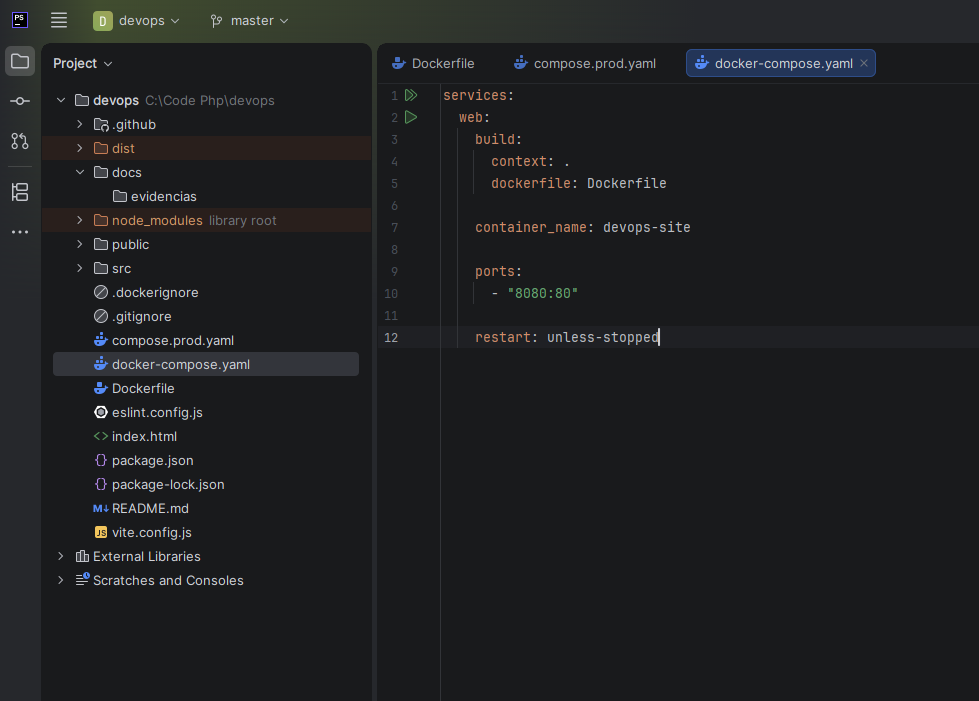
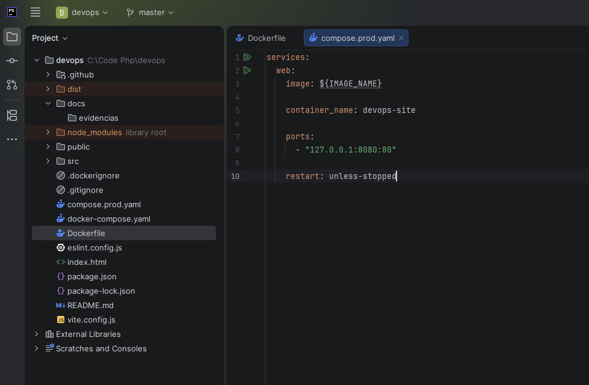

# 07 — Configuração Docker

## Imagem multi-stage

O Dockerfile possui duas etapas:

```dockerfile
FROM node:22-alpine AS build
WORKDIR /app
COPY package*.json ./
RUN npm ci
COPY . .
RUN npm run build

FROM nginx:alpine
COPY --from=build /app/dist /usr/share/nginx/html
EXPOSE 80
CMD ["nginx", "-g", "daemon off;"]
```

A etapa Node instala dependências e compila. A etapa final copia somente `dist/` para o diretório servido pelo Nginx; Node e dependências de desenvolvimento não são necessários no runtime. Copiar os manifestos antes do restante do código permite reaproveitar a camada de dependências quando eles não mudam.

`EXPOSE 80` descreve a porta interna; não publica uma porta no host. `daemon off;` mantém o Nginx em primeiro plano como processo principal do container. A imagem é o artefato construído; `devops-site` é o container criado a partir desse artefato.

## Compose local

O arquivo `docker-compose.yaml` define o ambiente local:

```yaml
services:
  web:
    build:
      context: .
      dockerfile: Dockerfile
    container_name: devops-site
    ports:
      - "8080:80"
    restart: unless-stopped
```

Na raiz do código-fonte:

```bash
docker compose -f docker-compose.yaml up -d --build
docker compose -f docker-compose.yaml ps
```

Acesse [localhost:8080](http://localhost:8080). Esta é a distribuição compilada, sem a atualização automática do servidor Vite. Para aplicar mudanças no código, repita o comando com `--build`. Para encerrar o ambiente local:

```bash
docker compose -f docker-compose.yaml down
```

A publicação `8080:80` não se restringe a localhost: pode aceitar conexões por outras interfaces do computador. O Compose de produção usa um bind diferente, descrito abaixo. Referência: [publicação de portas no Docker](https://docs.docker.com/engine/network/port-publishing/).

## Compose de produção

O arquivo `compose.prod.yaml` define a execução em produção:

```yaml
services:
  web:
    image: ${IMAGE_NAME}
    container_name: devops-site
    ports:
      - "127.0.0.1:8080:80"
    restart: unless-stopped
```

O serviço `web` usa a imagem pronta indicada por `IMAGE_NAME`, fornecida pelo CD como `ghcr.io/erikgdl/cloud-devops:latest`. O Nginx do host acessa `127.0.0.1:8080` e o Docker encaminha para a porta 80 do container. As portas públicas 80/443 pertencem ao Nginx do host.

Os dois Compose usam o mesmo nome de container e a mesma porta do host; são alternativas de ambiente e não devem ser iniciados simultaneamente no mesmo daemon. Na VPS, use o Compose de produção conforme [deploy](06-processo-de-deploy.md).

## Reinício e manutenção

`restart: unless-stopped` permite reinício segundo a política do Docker, mas mantém uma parada deliberada. No teste com `docker stop`, o retorno foi manual com `docker start`; a política não substitui esse procedimento nem faz rollback. Referência: [políticas de reinício](https://docs.docker.com/engine/containers/start-containers-automatically/).

Revise o `.dockerignore` do código-fonte antes de ampliar o contexto de build. Arquivos `.env`, credenciais e chaves não devem ser enviados à imagem. Variáveis incorporadas ao frontend durante o build podem ficar acessíveis no JavaScript público; não são local seguro para Secrets.

## Evidências






[Índice](README.md) · [Configuração DNS](08-configuracao-dns.md)
