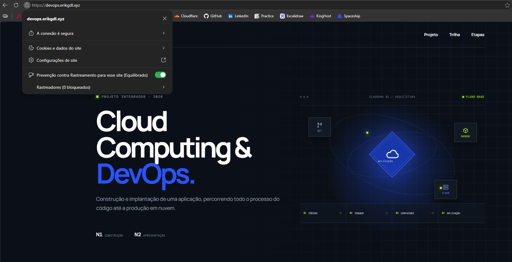
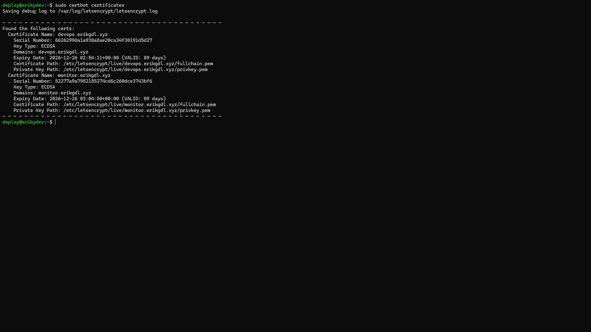
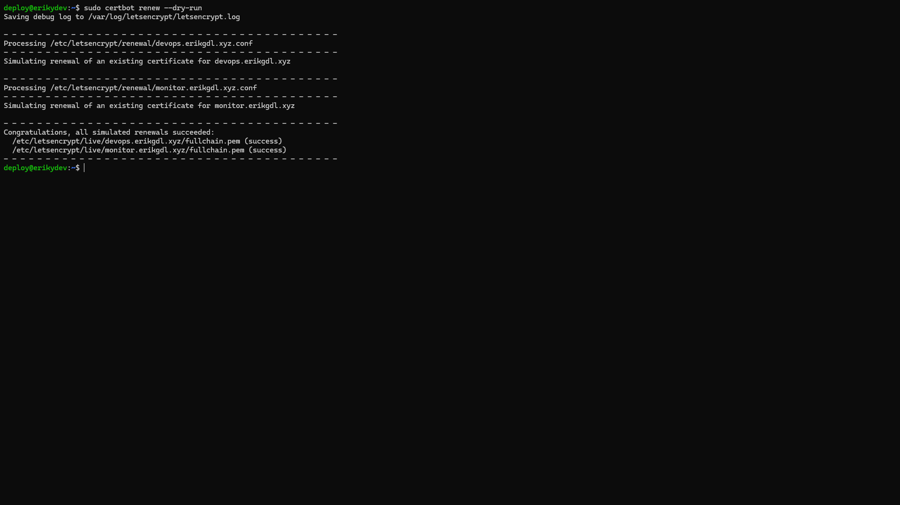

# 09 — HTTPS e reverse proxy

## Objetivo
Disponibilizar aplicação e monitoramento com TLS, permitindo comunicação cifrada e validação do domínio pelo navegador.

## Nginx na VPS
O Nginx do host recebe as conexões públicas e encaminha:
| Domínio | Serviço interno |
| --- | --- |
| devops.erikgdl.xyz | http://127.0.0.1:8080 |
| monitor.erikgdl.xyz | http://127.0.0.1:3001 |

A terminação TLS ocorre no proxy da VPS. O Nginx dentro de `devops-site` continua atendendo HTTP na porta 80 do container.

Os arquivos completos de configuração do Nginx do host não estão no repositório. Esta documentação descreve a arquitetura comprovada, sem apresentar um bloco de configuração reconstruído como se fosse cópia do servidor.

## Certbot e Let's Encrypt
Certbot gerencia os certificados emitidos pela Let's Encrypt. A verificação registrada foi:
```bash
sudo certbot certificates
```
A saída mostra certificados separados para `devops.erikgdl.xyz` e `monitor.erikgdl.xyz`, ambos válidos no momento da coleta.

Os certificados ficam sob `/etc/letsencrypt/live/<dominio>/`. O arquivo `fullchain.pem` contém a cadeia do certificado; `privkey.pem` é a chave privada e não deve ser copiado para o repositório. Nenhum conteúdo de chave é necessário para explicar a configuração.

## Renovação
O teste documentado é:
```bash
sudo certbot renew --dry-run
```
O resultado registra sucesso na simulação de renovação dos dois certificados. Essa validação comprova o teste naquele momento; não comprova, isoladamente, qual agendador de renovação está habilitado. A configuração do timer/cron não foi recuperada.

O comando original de emissão e a instalação do Certbot não constam nos registros disponíveis, portanto não foram inventados como etapas executadas.

## Evidências



