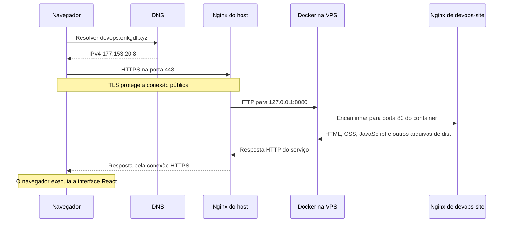

# 09 — Nginx e HTTPS

## Por que o projeto utiliza Nginx?

Nginx é um servidor web. Ele pode entregar arquivos de um diretório ou receber uma requisição e encaminhá-la a outro serviço, atuando como **reverse proxy**. O projeto utiliza as duas funções, em duas instâncias distintas. Referência: [guia do Nginx](https://nginx.org/en/docs/beginners_guide.html).

| Instância | Onde executa | Responsabilidade |
| --- | --- | --- |
| Nginx do host | Diretamente no Ubuntu da VPS | Receber HTTP/HTTPS, usar os certificados e encaminhar cada domínio ao serviço interno |
| Nginx da aplicação | Dentro de `devops-site` | Entregar os arquivos de `dist/` pela porta 80 do container |

O primeiro é a entrada pública compartilhada da VPS. O segundo faz parte da imagem da aplicação. Assim, a imagem permanece responsável pelo site e o host concentra domínio, certificados e encaminhamento.

## Como o reverse proxy escolhe o destino

O navegador acessa um nome, como `devops.erikgdl.xyz`. Após o DNS resolver o IP, a conexão chega ao Nginx do host, que associa o domínio solicitado à configuração do serviço e encaminha a requisição:

| Domínio solicitado | Destino interno |
| --- | --- |
| `devops.erikgdl.xyz` | `http://127.0.0.1:8080` |
| `monitor.erikgdl.xyz` | `http://127.0.0.1:3001` |

Nos arquivos de configuração do Nginx, `listen` identifica a porta, `server_name` identifica os nomes atendidos, `location` seleciona caminhos e `proxy_pass` define o destino do encaminhamento. Esses conceitos ajudam a ler e manter o proxy; o mapeamento acima resume os serviços deste projeto.

O visitante não precisa conhecer a porta 8080 ou 3001. A conexão pública utiliza 80/443, e o proxy realiza o acesso interno. O proxy também recebe a resposta do serviço e a devolve ao cliente.

## Uma requisição completa à aplicação



DNS retorna o endereço; ele não transporta o conteúdo da página. O Docker faz o mapeamento de portas, e o Nginx do container lê os arquivos em `/usr/share/nginx/html`. Requisições aos demais arquivos estáticos seguem o mesmo caminho.

O host também recebe HTTP na porta 80. O tratamento dessa entrada, inclusive eventual redirecionamento para HTTPS, depende do bloco HTTP configurado. Para conferir o comportamento efetivo, consulte os cabeçalhos conforme a seção de operação abaixo.

## Onde começa e termina o HTTPS

HTTPS é HTTP protegido por TLS. O navegador verifica o certificado do domínio e estabelece uma conexão cifrada com o Nginx do host. É ali que ocorre a **terminação TLS**: o proxy recebe a requisição protegida e encaminha outra requisição, por HTTP, dentro da VPS.

Portanto, os dois trechos têm papéis diferentes:

```text
Navegador ── HTTPS pela Internet ── Nginx do host
Nginx do host ── HTTP local ── Nginx do container
```

O certificado protege o acesso ao domínio público. O container da aplicação não precisa manter uma cópia da chave privada do certificado para funcionar nesse desenho.

## Certbot e Let's Encrypt

**Let's Encrypt** é a autoridade que emite os certificados. **Certbot** é a ferramenta utilizada no servidor para obtê-los e gerenciar sua renovação. O ambiente possui certificados separados para `devops.erikgdl.xyz` e `monitor.erikgdl.xyz`.

Os arquivos ficam sob `/etc/letsencrypt/live/<dominio>/`:

- `fullchain.pem`: certificado e cadeia apresentados ao cliente.
- `privkey.pem`: chave privada utilizada pelo servidor no TLS; deve permanecer protegida.

Essa chave privada é do HTTPS. Ela é diferente da chave SSH utilizada para entrar na VPS e do token que autoriza o GHCR.

## Conferir certificados e renovação

Na VPS:

```bash
sudo certbot certificates
sudo certbot renew --dry-run
```

A primeira consulta lista os certificados. O segundo comando simula uma renovação; o teste do projeto concluiu com sucesso para os dois domínios. Na manutenção, confira também se o mecanismo periódico de renovação instalado no servidor continua ativo: executar um dry-run não agenda, por si só, as próximas renovações.

## Operação do proxy

Para verificar a configuração e as respostas:

```bash
sudo nginx -t
sudo systemctl is-active nginx
curl -I http://devops.erikgdl.xyz
curl -I https://devops.erikgdl.xyz
curl -I https://monitor.erikgdl.xyz
```

Na consulta HTTP, observe o código retornado e eventual cabeçalho `Location`. No monitor, a interface pode redirecionar para autenticação; isso não é uma falha da aplicação.

Depois de uma alteração de configuração, valide antes de recarregar:

```bash
sudo nginx -t && sudo systemctl reload nginx
```

O teste verifica a configuração; o reload aplica a mudança no serviço. Se a aplicação responder localmente, mas falhar pelo domínio, investigue DNS, TLS e proxy antes de reconstruir a imagem.

## Por que a parada da aplicação gerou 502?

No teste, o Nginx do host continuou funcionando. O serviço interno, chamado de **upstream**, deixou de responder porque `devops-site` estava parado. O proxy recebeu a requisição pública, mas não conseguiu obter a resposta do upstream e retornou **502 Bad Gateway**. O [teste de recuperação](12-recuperacao.md) mostra a retomada.

## Evidências


[Índice](README.md) · [Git, branches e CI/CD](10-processo-ci-cd.md)
