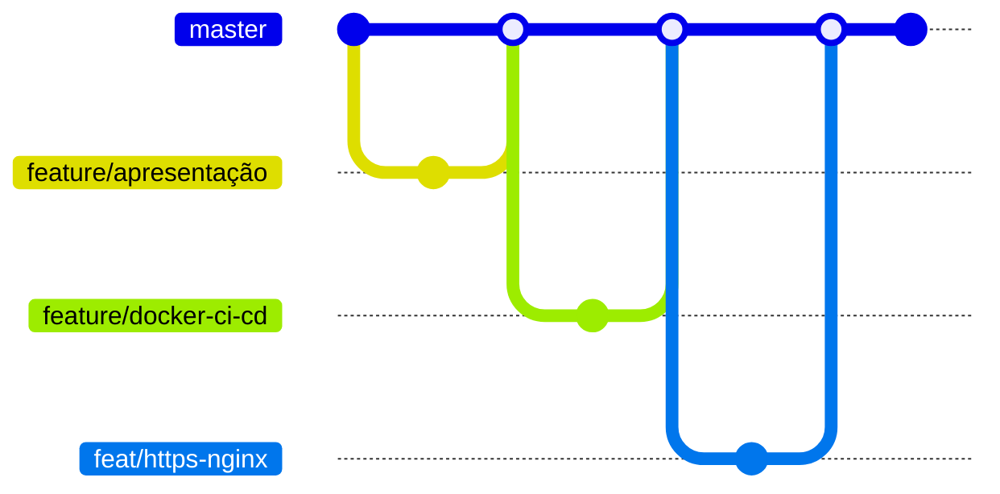
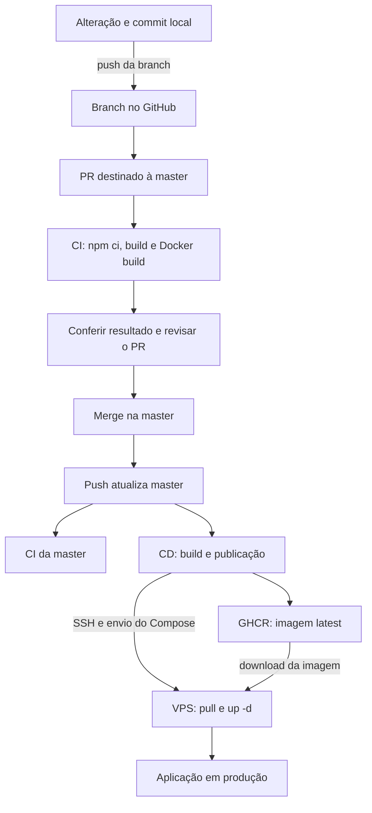

# 10 — Git, branches e CI/CD

## Como o trabalho foi organizado

Git registra as alterações em commits. Uma branch permite desenvolver uma etapa em uma linha de trabalho separada; o pull request (PR) reúne as mudanças para revisão e integração. O merge leva essas mudanças à branch principal.

A branch principal do projeto é **`master`**. As etapas foram integradas nesta ordem:

| Ordem | Branch de trabalho | Etapa |
| --- | --- | --- |
| 1 | `feature/apresentação` | Desenvolvimento da apresentação da aplicação |
| 2 | `feature/docker-ci-cd` | Containerização e automação de integração e entrega |
| 3 | `feat/https-nginx` | Configuração do acesso com Nginx e HTTPS |

Os prefixos `feature/` e `feat/` identificam branches de trabalho; os nomes acima preservam os utilizados no projeto, inclusive o acento em `apresentação`.

## Linha de evolução das branches

A linha do tempo mostra a ordem das integrações. Os pontos resumem etapas, sem representar a quantidade exata de commits ou suas datas.



Cada linha lateral representa o trabalho de uma etapa; o retorno à `master` representa sua integração. A exclusão de uma branch de trabalho após o merge não desfaz as mudanças integradas. Branches locais e remotas são referências distintas: remover uma no GitHub não apaga automaticamente a referência local.

## O fluxo de trabalho após configurar a automação

Com CI/CD implantados, as alterações seguem feature branch, push, PR, conferência do CI e merge. O diagrama abaixo representa esse fluxo de operação; a etapa inicial de apresentação antecedeu a construção da automação.



**CI e CD são workflows independentes.** O CI do PR permite conferir a alteração antes do merge. Já o CD disparado na `master` não aguarda o CI do mesmo push. Exigir aprovação antes de integrar depende das regras de proteção da branch.

## O que dispara cada workflow?

| Ação | CI | CD |
| --- | --- | --- |
| Commit apenas no computador | Não | Não |
| Push em feature sem PR | Não pelo gatilho final de push | Não |
| Abertura ou atualização de PR para `master` | Sim | Não |
| Push na `master`, inclusive por merge | Sim | Sim |

Na configuração final, o CI acompanha push na `master` e PRs destinados a ela. `feature/docker-ci-cd` foi uma branch de implementação e deixou de fazer parte do gatilho final; seu nome não é requisito para novas entregas. Referência: [gatilhos de workflows no GitHub Actions](https://docs.github.com/en/actions/how-tos/write-workflows/choose-when-workflows-run/trigger-a-workflow).

## CI: validar a construção

Integração contínua automatiza verificações sobre o código. Em `.github/workflows/ci.yml`, a execução obtém o código por checkout, prepara Node.js 22 e executa:

```bash
npm ci
npm run build
docker build -t devops-app .
```

O CI verifica a instalação das dependências e a construção da aplicação e da imagem. Não executa testes funcionais ou lint. A imagem construída nessa validação não é a publicação de produção: o CD realiza seu próprio build e push.

## CD: publicar e aplicar a atualização

Em `.github/workflows/cd.yml`, o push na `master` inicia checkout, login no GHCR, build/push da imagem, preparação do SSH, envio do Compose e atualização remota.

O runner é a máquina que executa o job do Actions. Ele prepara a publicação; a VPS é a máquina que mantém o serviço atendendo os visitantes. As permissões do CD incluem `contents: read` e `packages: write`.

A imagem publicada é `ghcr.io/erikgdl/cloud-devops:latest`. A sequência de comandos e o papel do registro estão em [deploy e GHCR](06-processo-de-deploy.md).

## Credenciais da automação

| Nome | Função |
| --- | --- |
| `VPS_HOST` | Secret com o endereço da VPS |
| `VPS_USER` | Secret com a conta remota `deploy` |
| `VPS_SSH_KEY_B64` | Secret com a chave privada SSH da automação em Base64 |
| `GITHUB_TOKEN` | Token fornecido pelo Actions para operações autorizadas com GitHub/GHCR |

Secrets armazenam os valores sensíveis fora do código versionado. O workflow os utiliza durante a execução, sem precisar inserir seu conteúdo no repositório.

Há duas autenticações distintas: **a chave SSH permite entrar na VPS; o token permite acessar o GHCR**. Codificar a chave em Base64 não transforma uma credencial na outra. A localização das chaves, a diferença entre senha e passphrase e a correção de `libcrypto` estão em [VPS e segurança](05-processo-de-instalacao.md).

## Acompanhar uma entrega

No GitHub Actions, confira o commit associado à execução, o resultado do job e a etapa em que ocorreu eventual falha. Depois do CD, confirme a resposta HTTPS e o estado no monitor, conforme [verificação do deploy](06-processo-de-deploy.md).

Um commit local não publica. Um job de CI aprovado não publica por si só. A entrega se completa quando a imagem é publicada, a VPS aplica a atualização e a aplicação responde corretamente.

## Evidências


[Índice](README.md) · [Monitoramento](11-monitoramento.md)
