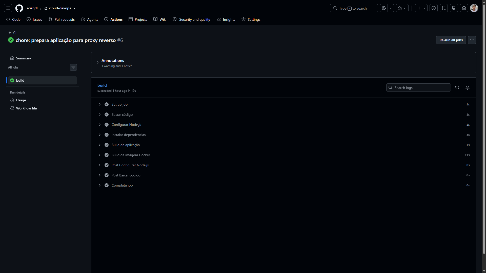
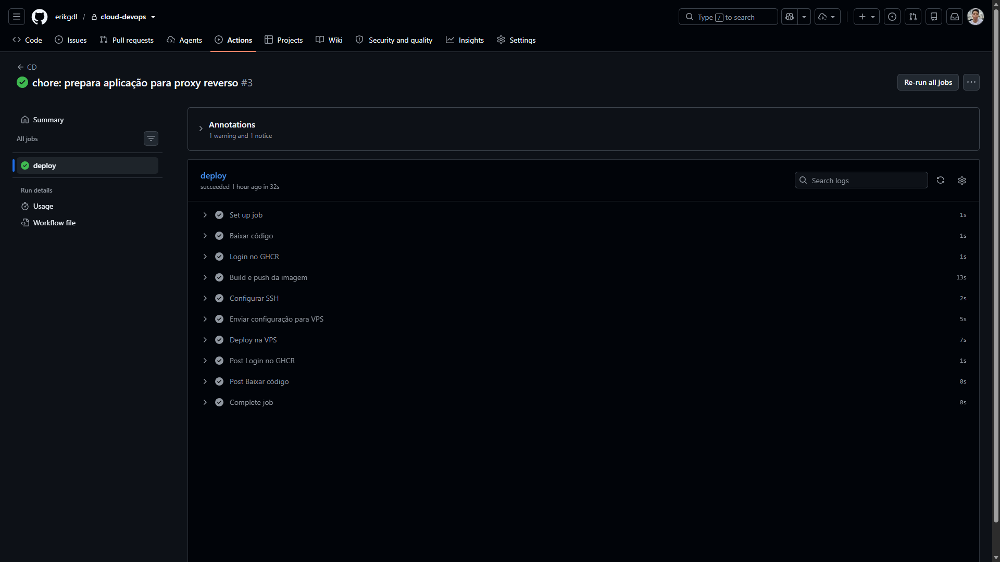
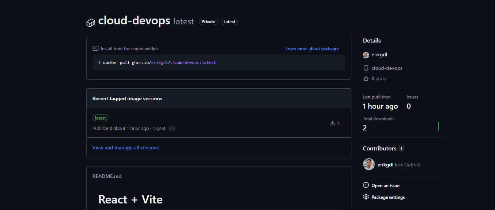

# 10 — Processo de CI/CD

## Integração contínua
O [ci.yml](../.github/workflows/ci.yml) executa em:
- pushes para `master` e `feature/docker-ci-cd`;
- pull requests destinados a `master`.

O job `build` usa `ubuntu-latest`, checkout v4 e setup-node v4, com Node.js 22 e cache npm. As validações são:
```bash
npm ci
npm run build
docker build -t devops-app .
```
O workflow comprova que dependências e builds podem ser processados. Não há etapa de testes automatizados nem execução do lint no CI atual.

## Entrega contínua
O [cd.yml](../.github/workflows/cd.yml) executa em push na `master`. Suas permissões são `contents: read` e `packages: write`.

A sequência é: checkout, login no GHCR, build/push, configuração SSH, transferência do Compose e deploy remoto. A imagem publicada é `ghcr.io/erikgdl/cloud-devops:latest`. A atualização detalhada está em [Deploy](06-processo-de-deploy.md).

Os workflows são independentes. O CD não usa `needs` ou `workflow_run` para aguardar o CI; o sucesso do CI não constitui uma condição explícita nesse arquivo.

## Secrets
| Nome referenciado | Finalidade |
| --- | --- |
| VPS_HOST | Endereço da VPS |
| VPS_USER | Usuário remoto deploy |
| VPS_SSH_KEY_B64 | Chave privada de automação codificada em Base64 |
| GITHUB_TOKEN | Token fornecido pelo GitHub Actions para autenticação no GHCR |

A tabela contém somente nomes e finalidades. O `GITHUB_TOKEN` é fornecido pelo Actions; os três valores VPS são configurados como Secrets do repositório.

## Chave SSH de automação e correção em Base64
As anotações registram a criação de uma chave ED25519 exclusiva para a automação, separada da chave pessoal. Sua chave pública foi adicionada ao `~/.ssh/authorized_keys` de `deploy`, preservando a autorização pessoal. A chave da automação foi preparada para uso não interativo.

A correção adotada passou a armazenar a chave privada codificada no Secret `VPS_SSH_KEY_B64` e reconstruí-la no runner, evitando depender da preservação de um texto multilinha no fluxo anterior. O comando exato que gerou o Base64 e a mensagem original da falha não constam nos registros recuperados.

O trecho efetivamente presente no CD é:
```bash
mkdir -p ~/.ssh
printf '%s' "${{ secrets.VPS_SSH_KEY_B64 }}" | base64 --decode > ~/.ssh/id_ed25519
chmod 600 ~/.ssh/id_ed25519
ssh-keyscan -H "${{ secrets.VPS_HOST }}" >> ~/.ssh/known_hosts
```
Base64 é uma codificação reversível, não criptografia. Seu conteúdo permanece secreto. A permissão 600 restringe a leitura da chave ao proprietário no runner.

O `ssh-keyscan` coleta a chave apresentada pelo host para `known_hosts`; o workflow atual não realiza comparação explícita com uma impressão digital previamente verificada.

## Resultado registrado
Os prints mostram execuções concluídas de CI e CD e a imagem no GHCR. Nenhuma senha, chave ou token precisa aparecer nessas evidências.




