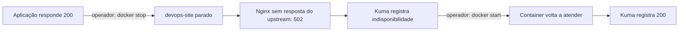
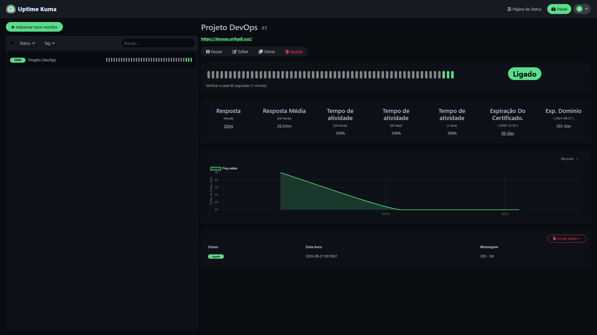
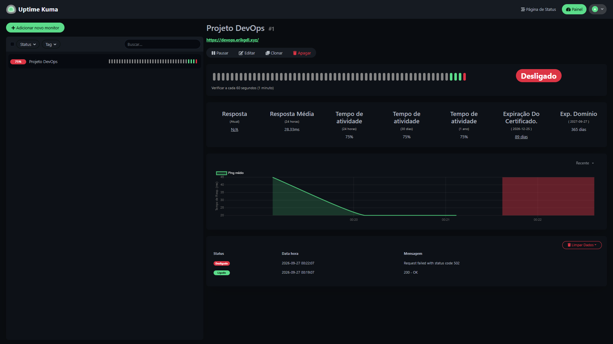
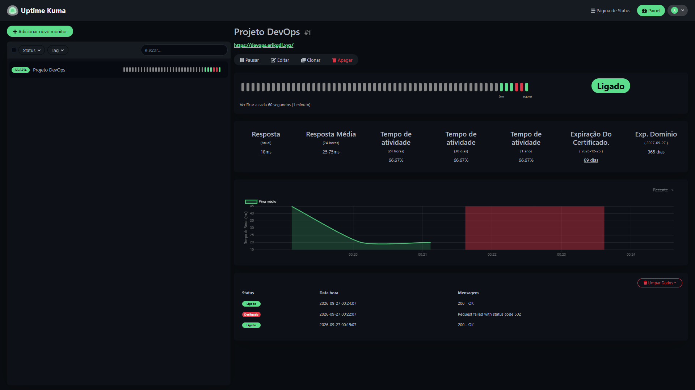

# 12 — Indisponibilidade e recuperação

## Teste executado

O teste controlado interrompeu somente o container `devops-site`, mantendo Nginx e Uptime Kuma ativos. O objetivo foi verificar a detecção da indisponibilidade e o retorno do serviço após intervenção manual.

Na sessão SSH da VPS, o procedimento informado foi:

```bash
docker ps
docker stop devops-site
```

**A parada torna a aplicação indisponível.** Esta é a descrição do teste realizado, não um comando de verificação rotineira. Após a consulta periódica, o monitor passou a `Desligado`, registrando 502.

A recuperação usou o mesmo container:

```bash
docker start devops-site
docker ps
```

O próximo registro saudável mostrou `200 - OK`. A política `unless-stopped` não desfaz uma parada deliberada; neste teste, o operador iniciou o container novamente.



## Resultado observado

| Horário mostrado no painel | Estado | Resposta |
| --- | --- | --- |
| 27/09/2026 00:19:07 | Ligado | `200 - OK` |
| 27/09/2026 00:22:07 | Desligado | `Request failed with status code 502` |
| 27/09/2026 00:24:07 | Ligado | `200 - OK` |

O fuso é o exibido pelo painel, sem conversão presumida. Os dois minutos entre os eventos de falha e recuperação não medem exatamente o tempo entre os comandos nem estabelecem um RTO: as consultas acontecem periodicamente. O histórico permanece e o percentual de disponibilidade continua refletindo a falha mesmo após o retorno ao estado saudável.

O 502 ocorreu porque o Nginx público estava acessível, mas seu upstream em `127.0.0.1:8080` não respondia. Quando o container voltou, o proxy conseguiu entregar novamente a aplicação.

## Diagnóstico operacional

Os comandos abaixo são referências de manutenção, não etapas adicionais comprovadas no teste. Na VPS:

```bash
docker ps -a --filter name=devops-site
docker logs --tail 100 devops-site
curl -sS -o /dev/null -w '%{http_code}\n' http://127.0.0.1:8080/
sudo nginx -t
sudo systemctl is-active nginx
curl -sS -o /dev/null -w '%{http_code}\n' https://devops.erikgdl.xyz/
```

| Sintoma | Próxima verificação |
| --- | --- |
| Container parado | Consultar logs e iniciar se a parada não deve continuar |
| Container inexistente | Reaplicar o Compose de produção pelo procedimento de deploy |
| Porta local sem resposta | Estado do container, logs e mapeamento de portas |
| Porta local responde, domínio retorna 502 | Destino upstream e configuração do Nginx do host |
| Falha de resolução do nome | Registros e resposta DNS |
| Erro de certificado | Domínio solicitado, certificado e renovação |
| `pull` negado | Autenticação vigente e permissão de leitura no GHCR |

Se o container foi removido, `docker start` não o recria. Use o procedimento de [deploy](06-processo-de-deploy.md), com Compose correto, `IMAGE_NAME` definida e imagem acessível. Não remova volumes do monitor para tentar corrigir uma falha da aplicação.

## Critério de retorno e limites

Considere a retomada confirmada após verificar container ativo, resposta local e pública da página principal, interface no navegador e nova consulta saudável do Kuma. Um container em estado `Up`, sozinho, não comprova que todo o caminho público funciona.

O teste demonstrou retomada manual do serviço existente. Restauração de backup, reconstrução da VPS e rollback de versão são procedimentos distintos e não fazem parte dessa recuperação.

## Evidências







[Índice](README.md) · [Conclusão e fluxo geral](13-conclusao.md)
