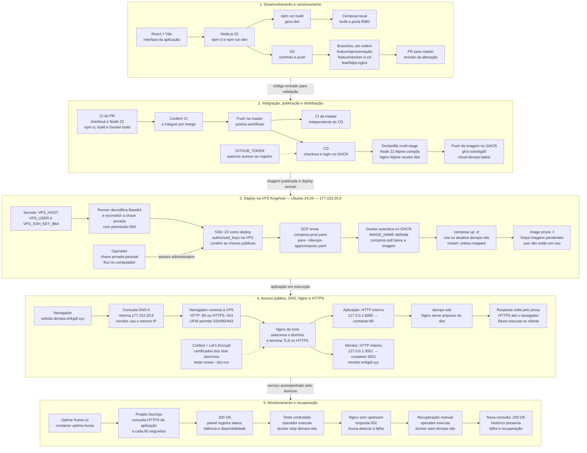

# 13 — Conclusão e fluxo geral

## Resultado do projeto

O `cloud-devops` conecta desenvolvimento e operação em um ambiente funcional: a aplicação React + Vite é versionada, construída em imagem Docker, publicada pelo GitHub Actions e executada em uma VPS com domínio e HTTPS. O Uptime Kuma acompanha o serviço e registra sua disponibilidade.

As etapas se complementam. Git organiza as alterações; o CI verifica os builds; o CD distribui e aplica a imagem; a VPS sustenta a execução; DNS e Nginx conduzem o acesso; TLS protege a comunicação pública; o monitoramento permite observar o resultado em produção.

## Do desenvolvimento ao monitoramento

O fluxo abaixo reúne a implementação. Leia de cima para baixo: desenvolvimento, automação, servidor, acesso público e operação. Cada grupo reúne uma etapa e suas dependências; as setas tracejadas indicam configuração ou autorização. A chave privada permanece no cliente SSH. As branches aparecem na ordem das etapas; a validação automática representa o fluxo adotado após a implantação do CI/CD.

## O que a implementação demonstrou

| Etapa | Resultado |
| --- | --- |
| Desenvolvimento | Interface React compilada em arquivos estáticos |
| Versionamento | Evolução organizada em branches e integrada à `master` |
| Containerização | Separação entre build Node e execução Nginx |
| Automação | Validação dos builds e deploy acionado pela atualização da `master` |
| Infraestrutura | Aplicação e monitor em containers na VPS, com acesso administrativo por chave |
| Publicação | Domínios atendidos pelo proxy e acesso HTTPS |
| Operação | Detecção de falha 502 e recuperação manual confirmada por resposta 200 |

## Limites operacionais

O ambiente concentra aplicação e monitor em uma VPS; uma falha completa do host afeta ambos. O teste realizado demonstra recuperação de um container parado, e não restauração integral do servidor. O fluxo também não oferece rollback automático ou garantia de atualização sem interrupção.

Esses limites orientam a manutenção: conferir cada publicação, acompanhar certificados e disponibilidade, proteger credenciais e preservar os dados do monitor. O projeto estabelece um ciclo de entrega e operação observável, com responsabilidades claras entre desenvolvimento, automação e infraestrutura.

[Índice](README.md) · [Apresentação do projeto](../README.md)
